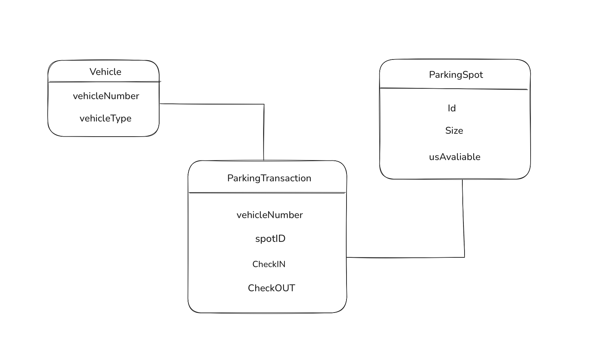

# Smart Parking Lot System – Low-Level Design

This project represents a **low-level backend architecture** for a Smart Parking Lot System. It handles dynamic parking space allocation, vehicle check-in/check-out, fee calculation, and updates availability in real-time using simple in-memory structures and JavaScript.

---

## Objective

Design a scalable and modular backend system for a multi-level parking lot that can:

- Allocate parking spots based on vehicle type (bike, car, bus)
- Track check-in and check-out times
- Calculate parking fees by duration and vehicle size
- Update parking spot availability in real-time

---

## Features

- Parking Spot Allocation by vehicle type
- Time tracking for check-in and check-out
- Dynamic fee calculation based on hours
- Real-time update of spot availability
- Simulated DB using JavaScript objects and arrays

---

## Technologies Used

- JavaScript (Vanilla)
- No external DB used – Mock DB implemented using JS arrays
- No frameworks – fully written from scratch

---

## Data Model (ER Diagram)

Entities:
- **Vehicle**: `vehicleNumber`, `type`
- **ParkingSpot**: `id`, `size`, `isAvailable`
- **ParkingTransaction**: `vehicleNumber`, `spotId`, `entryTime`, `exitTime`, `fee`

---

## How It Works

1. When a vehicle enters:
   - Finds an available parking spot based on size
   - Stores entry time and vehicle info
   - Marks spot as unavailable

2. When a vehicle exits:
   - Finds the related transaction
   - Calculates time spent and fee
   - Marks spot as available again

---

